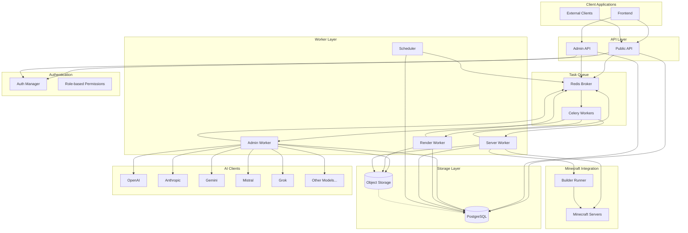

# MC Bench Backend

Backend archictecture



# Development Setup


## 1. Setup python

Python 3.12.7 installed. We recommend [pyenv]("https://github.com/pyenv/pyenv").

```shell
pyenv install 3.12.7
```

## 2. Setup python environment

2. A virtual environment created and activated somewhere

    via pyenv (recommended)
    ```shell
   pyenv virtualenv 3.12.7 mc-bench-backend
   pyenv activate mc-bench-backend
   ```
   
    via vanilla venv

    ```shell
    pyenv shell 3.12.7
    python -m venv .venv
    source .venv/bin/activate
    ```
    Any other mechanism should work as well

## 3. Setup secrets
Copy the .env file

```bash
cp .env.template .env
```

Populate the `.env` with your values.

## 4. Setup login 
See [frontend setup docs](https://github.com/mc-bench/mc-bench-frontend/blob/main/docs/setup_oauth_prereqs.md) for setting up a a Github Oauth 2.0 app.

Update the values in your local env file as:
```
export GITHUB_CLIENT_ID="<your_client_id>"
export GITHUB_CLIENT_SECRET="<your_client_secret>"
```

Auth call back URL should be on ```http://localhost:5173/login```


## 5. Install `mc-bench` into local python
Install the project, as an editable package
```bash
pip install -e .[dev]
```
 

## 6. Database Setup
Once you have completed setting up the python enviornment, it is time to setup the databases.

This application requires 3 databases: postgres, redis, 

There are 2 approaches, running the database as a local service or from the docker-compose.

## Option 1: Docker run as background services (recommended)
This will run the doc

```bash
docker-compose run -d -p 5432:5432 postgres
docker-compose run -d -p 6379:6379 redis 
```

## Option 2: Install packages manually and run services

MacOS [homebrew](https://brew.sh/) setup
 
    brew install postgresql@16
    brew install redis
   
    brew services start postgresql@16
    brew services start redis
 

You will need to create a database 
 
    ./bin/manual-postgres-setup
 


## 7. Run migrations
Load the environment variables with
```bash
source .env
```

With the python virtual environment activated, run the database migrations

```shell
mc-bench-alembic upgrade head
```

Or run 
```shell
docker-compose run --rm api mc-bench-alembic upgrade head
```


## 8. Login and give yourself a role

Running the frontend and the backend, signup and create a username.

Then use:

```python
./bin/grant-user-role grant --username {your username} --role admin
```
To see the usernames use:

```shell

./bin/grant-user-role list-users
```

To see the roles use:

```shell

./bin/grant-user-role list-roles
```

# Start the ephemeral game server
Build your own ephemeral game server locally. See [build documentation](https://github.com/mc-bench/mc-bench-backend/blob/main/docs/build_local_gameservers.md) for more details.

Run
```bash
cd ../gameservers
git checkout minecraft-1.21.1
docker build -t registry.digitalocean.com/mcbench/gameservers:minecraft-1.21.1-latest .
```


# Services run via docker

The following command will start all the services up

    docker-compose up -d --build

See the docker-compose.yml file for what services are started up and which ports they are listening on

`TODO: figure out hot reloading in the containers`

# Tail the logs

```shell
docker-compose logs -f
```

# Logging Configuration

The application uses structured logging with configurable log levels. The default level is INFO, but you can change it to DEBUG for more detailed logs:

```shell
# In your .env file or as environment variables:
export LOG_LEVEL="DEBUG"  # Options: DEBUG, INFO, WARNING, ERROR, CRITICAL
```

Additionally, several interval settings control how frequently certain operations are logged at INFO level:

```shell
# Log every N blocks placed during rendering
export LOG_INTERVAL_BLOCKS="100"  

# Log every N materials baked during rendering
export LOG_INTERVAL_MATERIALS="10"  

# Log every N build commands during server operations
export LOG_INTERVAL_COMMANDS="50"  

# Log export progress at every N percent complete
export LOG_INTERVAL_EXPORT_PERCENT="10"
```

# Formatting/Linting

Run the ruff formatter
```shell
make fmt
````

Run the ruff checker
```shell
make check
```

Run the ruff checker with --fix option
```shell
make check-fix
```

# Working on the rendering code

Unfortunately bpy, the python library for Blender, is not compatible with python 3.12.
If you want to work on the rendering code, you need to use python 3.11.7.
Once you have installed the python 3.11.7 environment, you can install the dependencies with:

```shell
pip install -e .[render-worker]
```

# Other Useful Guides

- [Build local gameservers](docs/build_local_gameservers.md)
