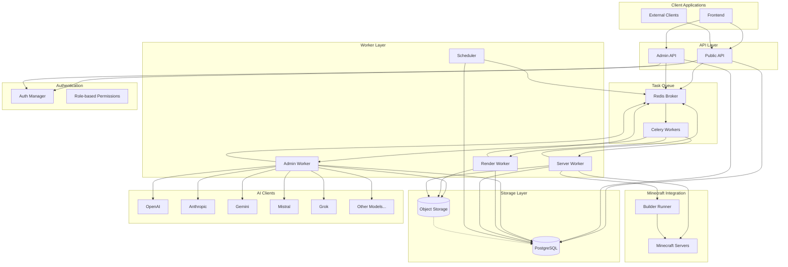

Backend archictecture

```mermaid
graph TD
    subgraph "Client Applications"
        FE[Frontend]
        External[External Clients]
    end

    subgraph "API Layer"
        API[Public API]
        AdminAPI[Admin API]
    end

    subgraph "Worker Layer"
        AdminWorker[Admin Worker]
        RenderWorker[Render Worker]
        ServerWorker[Server Worker]
        Scheduler[Scheduler]
    end

    subgraph "Storage Layer"
        DB[(PostgreSQL)]
        ObjStore[(Object Storage)]
    end

    subgraph "Minecraft Integration"
        MC[Minecraft Servers]
        Builder[Builder Runner]
    end

    subgraph "AI Clients"
        OpenAI[OpenAI]
        Anthropic[Anthropic]
        Gemini[Gemini]
        Mistral[Mistral]
        Grok[Grok]
        Other[Other Models...]
    end

    subgraph "Task Queue"
        CeleryBroker[Redis Broker]
        CeleryWorkers[Celery Workers]
    end

    subgraph "Authentication"
        Auth[Auth Manager]
        Roles[Role-based Permissions]
    end

    %% Client connections
    FE --> API
    FE --> AdminAPI
    External --> API

    %% API connections
    API --> Auth
    AdminAPI --> Auth
    API --> DB
    AdminAPI --> DB
    API --> CeleryBroker
    AdminAPI --> CeleryBroker

    %% Worker connections
    AdminWorker --> CeleryBroker
    RenderWorker --> CeleryBroker
    ServerWorker --> CeleryBroker
    Scheduler --> CeleryBroker

    AdminWorker --> DB
    RenderWorker --> DB
    ServerWorker --> DB
    Scheduler --> DB

    AdminWorker --> ObjStore
    RenderWorker --> ObjStore
    ServerWorker --> ObjStore

    %% Minecraft integration
    ServerWorker --> MC
    ServerWorker --> Builder
    Builder --> MC

    %% AI model integrations
    AdminWorker --> OpenAI
    AdminWorker --> Anthropic
    AdminWorker --> Gemini
    AdminWorker --> Mistral
    AdminWorker --> Grok
    AdminWorker --> Other

    %% Task queue
    CeleryBroker --> CeleryWorkers
    CeleryWorkers --> AdminWorker
    CeleryWorkers --> RenderWorker
    CeleryWorkers --> ServerWorker

    %% Storage
    ObjStore -.-> DB
```
